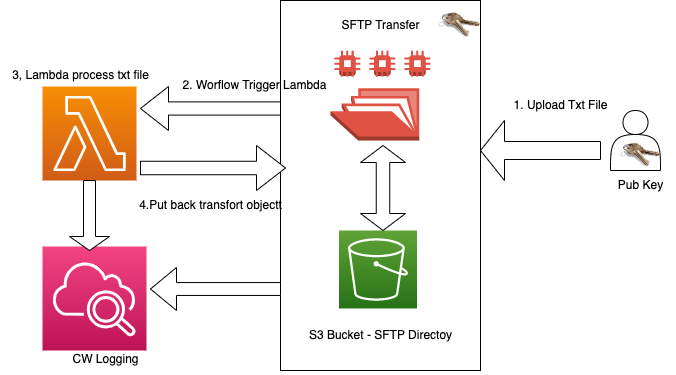

# aws-sftp-ssignment
Assignment to create sftp server and text file manipulation  in aws using terrraform 

[[_TOC_]]

This terraform module will deploy the following services:

- [x] Transfer "SFTP" family
    - sftp with s3 directory
    - workflow - lambda 
    - Iam to assume lambda
    - Iam to assume s3 bucket
- [x] Lambda
    - Function
    - Iam s3 & cloudwatch access
- [x] S3 Bucket
    - Bucket
    - Role Policy

## Thoughts on the soluation ?
- Using aws serviceless service
    - AWS transfer AWS native sftp service, integrate well with s3/lambda
    - Lambda cost effective and agile
    - S3 Bucket scalable, Durability many features
- Using Terraform 
    - easy to automate and maintain setup state 
    - principles Infrastructure as a Code 
- security/zero-trust
    - encryption at rest within bucket "s3 encryption"
    - encryption in transit between native aws service
    - sftp use public key encryption
    - least privilege deployment with IAM roles/policys
- flow overview 



## Usage Instructions
- Add/Update inputs entries, 
- Then validate, plan and apply resources
```
terraform init
terraform validate
terraform plan
terraform apply -auto-approve
```
- To destroy note default bucket_on_destroy value is true
```
terraform destroy
```

## Requirements
| Name | Version |
|------|---------|
| terraform | >= 1.0.0 |
| aws | >= 4.0.0 |
| random | >= 3.1.0 |

## Inputs/Variables
| Name | info |
|------|---------|
| bucket_name | name for s3 bucket used as sftp directory |
| sftp_servername | sftp server name |
| sftp_users | sftp username |
| sftp_users_ssh_key | ssh public keys for users |
| lambda_location | lambda function location zip file |

## Outputs

| Name | Description |
|------|-------------|
| arn | ARN of transfer server |
| id | ID of transfer server |
| endpoint | Endpoint of transfer server |

